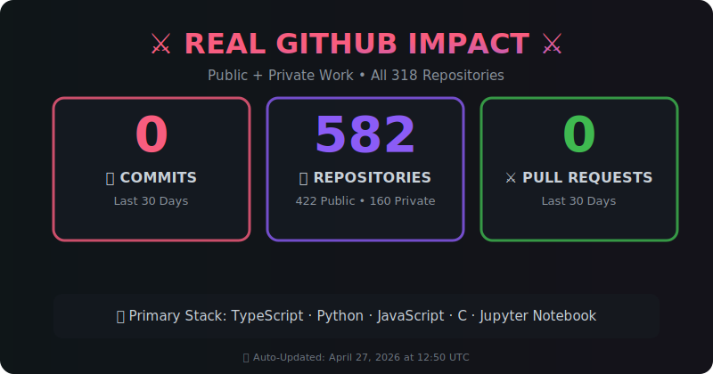
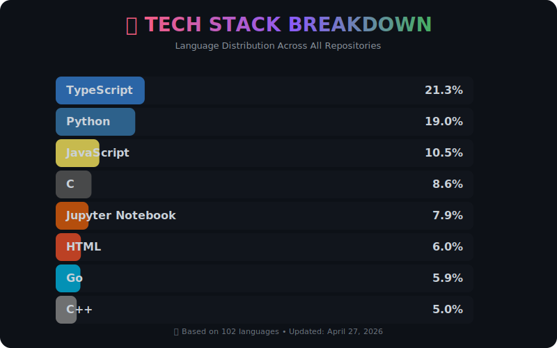
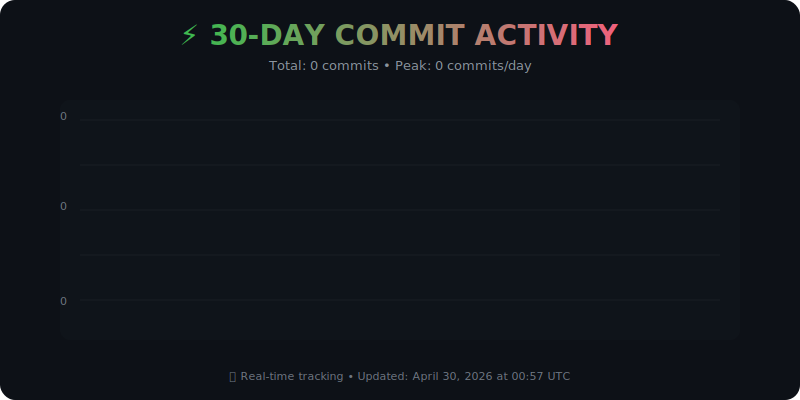

# ⚔️ **Immutable Mike Seiler** 👽

### *Systems Architect | Edge-Native genAI Engineer | Tokenized Economies | Quant + Web3 Architect*

### *Founder, Immutability.Space | HumanAtlas.ai*

**Systems that merge intelligence, commerce, and infrastructure** 🔥 **Available for Fractional CTO Roles** ⚡

---

I build systems that merge **intelligence, commerce, and infrastructure.** 🛸

After 25 years leading design and automation in fashion and manufacturing, I pivoted into full-stack software development and AI infrastructure—where I now operate at the intersection of **AI/ML**, **Web3**, **quantitative finance**, and **creator economies.** 💀

As founder of **Immutability.Space**, I design modular, agentic systems that connect humans, algorithms, and economies. My work merges **blockchain interoperability**, **local AI deployment**, and **data sovereignty**, creating architectures where creativity, content, and capital flow freely—securely owned, locally run, globally connected. 😈

**Available for Fractional CTO, System Design, Advisory and Project Manager Roles** — helping teams scale AI-native, secure, and observable systems. ⚔️

> *"I'm a systems architect and fractional CTO specializing in AI/ML infrastructure, Web3 interoperability, and quantitative trading systems. I help teams move from prototype to production—building modular, observable, and tokenized architectures that scale securely."* 🔥

### 🔗 **Connect with me:**

### 🏢 **Current Focus**

- 🔭 I'm currently working on [The Immutability Space](https://www.immutability.space) 👽
- 🌱 I'm currently learning **Quant Data Science - How to not blow up my systems** 💀
- 👯 I'm looking to collaborate on [AI Dev Things](https://www.immutability.space) ⚔️
- 🤝 I'm looking for help with [The Human Atlas](https://www.humanatlas.ai) 🔥
- 👨‍💻 All of my projects are available at [https://www.immutability.space](https://www.immutability.space) ⚡
- 📝 I regularly write articles on [https://www.immutability.space/blog](https://www.immutability.space/blog) 🛸
- 💬 Ask me about **Tokenizing Everything and Audience Segmentation with Blockchain and AI** 😈
- 📫 How to reach me **<space@immutability.space>** 😸
- ⚡ Fun fact **Young Dev in an Old Body** 🧙‍♂️

---

## ⚔️ **Professional Experience**

### 💀 **Founder / Systems Architect — Immutability.Space**

*2023 – Present | Global / Remote*

Building the development rails for a tokenized, agentic future—where blockchain, AI, and human creativity converge. Engineering multi-phase systems merging Web3 infrastructure with local AI deployment to enable interoperable social connectivity, verified content provenance, and tokenized asset classes. 🛸

**Key Projects:**

- **Toy.Soldiers** – streaming and phygital goods exchange 💀
- **Done4You.LLC** – AI-driven business formation and compliance automation ⚔️
- **Thingspace.Fun** – developer tools optimizing GitHub and `.env` orchestration 🔥
- **ELI5** – real-time comprehension and translation engine 👽
- **LeanDeck** – contextual learning platform turning content into personal curricula ⚡

**Stack:** FastAPI · Supabase · Cloudflare Workers · Terraform · Docker · Hugging Face · vLLM · LangGraph · Solidity · Rust · Next.js

### 🔥 **Fractional CTO / Product Systems Architect**

*Consulting via Immutability.Space | 2022 – Present*

Partnering with founders, investors, and product teams to **translate vision into working systems** across software, media, and intelligent automation. When companies want to move confidently into AI or Web3, I architect, build, and operationalize the platforms that make it real. 😈

**Impact:**

- 12+ commercial launches across AI, Web3, and creator ecosystems in 24 months ⚔️
- Architected platforms with **ARR exceeding $4M**, **30K+ active creators**, **>99.9% uptime** 💀
- Reduced iteration cycles by **4×** through observability-first design 🔥
- Delivered sovereign data and local LLM deployments with **sub-60ms inference latency** ⚡

**Core Stack:** FastAPI · React / Next.js · Docker / Kubernetes · Cloudflare Workers · Supabase · Postgres · Redis · Kafka · Qdrant · vLLM · LangGraph · Terraform

### 🛸 **Founder / Lead Engineer — QuantDNA**

*2021 – 2023 | Los Angeles, CA*

Built AI/ML-driven quantitative trading system for futures, forex, and derivatives, focused on predictive, causal, and millisecond execution modeling. 💀

- Managed $1M AUM pilot fund with automated trade routing ⚔️
- Deployed 25+ concurrent strategies daily with Monte Carlo and walk-forward testing 🔥
- Full observability layer using Prometheus, Grafana, Loki, and Uptime Kuma ⚡

**Stack:** Python · FastAPI · vLLM · PyTorch · XGBoost · FinBERT · DuckDB · Supabase

### 👽 **Founder / Architect — Duna Energy**

*2020 – 2022 | Dubai Free Zone / Remote*

Built cross-chain renewable energy exchange and carbon-offset tokenization platform under Dubai Freeport license. Designed to fractionalize PPAs and reconcile carbon emissions data across sovereign jurisdictions. 😈

- Created on-chain frameworks for fractional renewable energy ownership 💀
- Integrated Fireblocks and Chainalysis KYCU compliance for multi-jurisdictional transactions ⚔️
- Deployed wrapped tokens enabling interoperability between sovereign and private market actors 🔥

**Stack:** Solidity · Rust · Fireblocks · Chainalysis · Cloudflare · Terraform

---

## 🔥 **Current AI Development Projects**

> **Note:** Most of my work is private - sorry, I need to be a better community contributor! 😸 These are the public projects I'm excited to share:

### ⚔️ **Featured Open Source Tools**

**🔥 GitTalker** - *The realest GitHub repository assistant with urban energy* 💀

- AI-powered repository analysis and interaction tool
- Brings personality and intelligence to Git workflow automation
- Python-based with natural language processing capabilities

**🛸 ENVable** - *Lightning-fast environment variable and secrets deployment* ⚡

- Solves the universal developer pain point of environment management
- Sync .env files to GitHub secrets across multiple repositories instantly
- Built for AI-speed development workflows

**👽 D4Y_Registrar** - *50-State Business Registration Automation System* 😈

- Automates complex business registration processes across all US states
- Streamlines regulatory compliance with intelligent workflow management
- Demonstrates enterprise-grade automation thinking

### 💀 **Development Infrastructure**

**agent_lab** - Experimental AI agent development environment ⚔️
**dotfiles** - My persistent development environment configuration 🔥
**infra_monitor** - Infrastructure monitoring and alerting systems ⚡
**mcp_launcher** - Model Context Protocol integration tools 🛸

---

## ⚔️ **Technical Stack & Expertise**

### **Systems Architecture & AI/ML** 🔥

### **Web3 & Blockchain** 💀

### **Infrastructure & DevOps** ⚡

### 💀 **Core Technical Skills**

**Languages:** Python (3.11+) · Rust · Solidity · SQL · TypeScript · Bash · R · HTML/CSS

**AI/ML & Data:** PyTorch · TensorFlow · XGBoost · LightGBM · vLLM · Hugging Face · FinBERT · DeepAR · LSTM · Monte Carlo Simulation · Reinforcement Learning · MLflow · Optuna

**Infrastructure:** Docker · Kubernetes · Terraform · Cloudflare · Supabase · Postgres · Redis · Kafka · ClickHouse · Qdrant · DuckDB · Prometheus · Grafana

**Web3:** Solidity · Rust · Smart Contracts · Tokenization · Web3 Interoperability · Decentralized Architecture · Data Sovereignty

**Frameworks:** FastAPI · LangChain · LangGraph · Next.js · React/Native · Cloudflare Workers

### 🔥 **Languages and Tools:**

### 🔥 **Specialized Expertise**

⚔️ **AI Infrastructure & Agentic Systems** | 💀 **Web3 Interoperability** | 🛸 **Quantitative Trading** | 👽 **Edge-Native Architecture**
😈 **Creator Economy Platforms** | 🌱 **Tokenized Renewable Energy** | ⚡ **Streaming Systems** | 🔥 **Data Sovereignty**

### 💀 **Industry Focus Areas**

- **AI/ML Infrastructure**: Edge compute, local AI deployment, agentic systems, observability ⚔️
- **Web3 & Tokenization**: Smart contracts, asset tokenization, creator economies, carbon markets 🔥
- **Quantitative Finance**: Algorithmic trading, risk management, portfolio optimization, Monte Carlo ⚡
- **Creator Platforms**: Streaming ecosystems, content monetization, tokenized access models 👽

---

## 🛸 **GitHub Impact**

### 💀 **Real Stats (Public + Private Work)**

**🔥 792 Commits (Last 30 Days)** | **⚔️ 0 Pull Requests** | **🛸 374 Total Repositories**

**📊 Primary Stack:** | **⚔️ 0 Pull Requests** | **🛸 374 Total Repositories**

**📊 Primary Stack:** Python · TypeScript · JavaScript · C · Jupyter Notebook · C#

**📊 Primary Stack:** Python · TypeScript · JavaScript · C · Jupyter Notebook · C#

**📊 Primary Stack:** Python · TypeScript · JavaScript · C · Jupyter Notebook · C#

**📊 Primary Stack:** Python · TypeScript · JavaScript · C · Jupyter Notebook · C#

**📊 Primary Stack:** Python · TypeScript · JavaScript · C · Jupyter Notebook · C#

**📊 Primary Stack:** Python · TypeScript · JavaScript · C · Jupyter Notebook · C#

**📊 Primary Stack:** Python · TypeScript · JavaScript · C · Jupyter Notebook · C#

**📊 Primary Stack:** Python · TypeScript · JavaScript · C · Jupyter Notebook · C#

**📊 Primary Stack:** Python · TypeScript · JavaScript · C · Jupyter Notebook · C#

**📊 Primary Stack:** Python · TypeScript · JavaScript · C · Jupyter Notebook · C#

**📊 Primary Stack:** Python · TypeScript · JavaScript · C · Jupyter Notebook · C#

**📊 Primary Stack:** Python · TypeScript · JavaScript · C · Jupyter Notebook · C#

**📊 Primary Stack:** Python · TypeScript · JavaScript · C · Jupyter Notebook · C#

**📊 Primary Stack:** Python · TypeScript · JavaScript · C · Jupyter Notebook · C#

**📊 Primary Stack:** Python · TypeScript · JavaScript · C · Jupyter Notebook · C#

**📊 Primary Stack:** Python · TypeScript · JavaScript · C · Jupyter Notebook · C#

**📊 Primary Stack:** Python · TypeScript · JavaScript · C · Jupyter Notebook · C#

**📊 Primary Stack:** Python · TypeScript · JavaScript · C · Jupyter Notebook · C#

**📊 Primary Stack:** Python · TypeScript · JavaScript · C · Jupyter Notebook · C#

**📊 Primary Stack:** Python · TypeScript · JavaScript · C · Jupyter Notebook · C#

**📊 Primary Stack:** Python · TypeScript · JavaScript · C · Jupyter Notebook · C#

**📊 Primary Stack:** Python · TypeScript · JavaScript · C · Jupyter Notebook · C#

**📊 Primary Stack:** Python · TypeScript · JavaScript · C · Jupyter Notebook · C#

**📊 Primary Stack:** Python · TypeScript · JavaScript · C · Jupyter Notebook · C#

**📊 Primary Stack:** Python · TypeScript · JavaScript · C · Jupyter Notebook · C#

**📊 Primary Stack:** Python · TypeScript · JavaScript · C · Jupyter Notebook · C#

**📊 Primary Stack:** Python · TypeScript · JavaScript · C · Jupyter Notebook · C#

**📊 Primary Stack:** Python · TypeScript · JavaScript · C · Jupyter Notebook · C#

**📊 Primary Stack:** Python · TypeScript · JavaScript · C · Jupyter Notebook · C#

**📊 Primary Stack:** Python · TypeScript · JavaScript · C · Jupyter Notebook · C#

**📊 Primary Stack:** Python · TypeScript · JavaScript · C · Jupyter Notebook · C#

**📊 Primary Stack:** Python · TypeScript · JavaScript · C · Jupyter Notebook · C#

**📊 Primary Stack:** Python · TypeScript · JavaScript · C · Jupyter Notebook · C#

**📊 Primary Stack:** Python · TypeScript · JavaScript · C · Jupyter Notebook · C#

**📊 Primary Stack:** Python · TypeScript · JavaScript · C · Jupyter Notebook · C#

**📊 Primary Stack:** Python · TypeScript · JavaScript · C · Jupyter Notebook · C#

**📊 Primary Stack:** Python · TypeScript · JavaScript · C · Jupyter Notebook · C#

**📊 Primary Stack:** Python · TypeScript · JavaScript · C · Jupyter Notebook · C#

**📊 Primary Stack:** Python · TypeScript · JavaScript · C · Jupyter Notebook · C#

**📊 Primary Stack:** Python · TypeScript · JavaScript · C · Jupyter Notebook · C#

**📊 Primary Stack:** Python · TypeScript · JavaScript · C · Jupyter Notebook · C#

**📊 Primary Stack:** Python · TypeScript · JavaScript · C · Jupyter Notebook · C#

**📊 Primary Stack:** Python · TypeScript · JavaScript · C · Jupyter Notebook · C#

**📊 Primary Stack:** Python · TypeScript · JavaScript · C · Jupyter Notebook · C#

**📊 Primary Stack:** Python · TypeScript · JavaScript · C · Jupyter Notebook · C#

**📊 Primary Stack:** Python · TypeScript · JavaScript · C · Jupyter Notebook · C#

**📊 Primary Stack:** Python · TypeScript · JavaScript · C · Jupyter Notebook · C#

**📊 Primary Stack:** Python · TypeScript · JavaScript · C · Jupyter Notebook · C#

**📊 Primary Stack:** Python · TypeScript · JavaScript · C · Jupyter Notebook · C#

**📊 Primary Stack:** Python · TypeScript · JavaScript · C · Jupyter Notebook · C#

**📊 Primary Stack:** Python · TypeScript · JavaScript · C · Jupyter Notebook · C#

**📊 Primary Stack:** Python · TypeScript · JavaScript · C · Jupyter Notebook · C#

**📊 Primary Stack:** Python · TypeScript · JavaScript · C · Jupyter Notebook · C#

**📊 Primary Stack:** Python · TypeScript · JavaScript · C · Jupyter Notebook · C#

**📊 Primary Stack:** Python · TypeScript · JavaScript · C · Jupyter Notebook · C#

**📊 Primary Stack:** Python · TypeScript · JavaScript · C · Jupyter Notebook · C#

**📊 Primary Stack:** Python · TypeScript · JavaScript · C · Jupyter Notebook · C#

**📊 Primary Stack:** Python · TypeScript · JavaScript · C · Jupyter Notebook · C#

**📊 Primary Stack:** Python · TypeScript · JavaScript · C · Jupyter Notebook · C#

**📊 Primary Stack:** Python · TypeScript · JavaScript · C · Jupyter Notebook · C#

**📊 Primary Stack:** Python · TypeScript · JavaScript · C · Jupyter Notebook · C#

**📊 Primary Stack:** Python · TypeScript · JavaScript · C · Jupyter Notebook · C#

**📊 Primary Stack:** Python · TypeScript · JavaScript · C · Jupyter Notebook · C#

**📊 Primary Stack:** Python · TypeScript · JavaScript · C · Jupyter Notebook · C#

**📊 Primary Stack:** Python · TypeScript · JavaScript · C · Jupyter Notebook · C#

**📊 Primary Stack:** Python · TypeScript · JavaScript · C · Jupyter Notebook · C#

**📊 Primary Stack:** Python · TypeScript · JavaScript · C · Jupyter Notebook · C#

**📊 Primary Stack:** Python · TypeScript · JavaScript · C · Jupyter Notebook · C#

**📊 Primary Stack:** Python · TypeScript · JavaScript · C · Jupyter Notebook · C#

**📊 Primary Stack:** Python · TypeScript · JavaScript · C · Jupyter Notebook · C#

**📊 Primary Stack:** Python · TypeScript · JavaScript · C · Jupyter Notebook · C#

**📊 Primary Stack:** Python · TypeScript · JavaScript · C · Jupyter Notebook · C#

**📊 Primary Stack:** Python · TypeScript · JavaScript · C · Jupyter Notebook · C#

**📊 Primary Stack:** Python · TypeScript · JavaScript · C · Jupyter Notebook · C#

**📊 Primary Stack:** Python · TypeScript · JavaScript · C · Jupyter Notebook · C#

**📊 Primary Stack:** Python · TypeScript · JavaScript · C · Jupyter Notebook · C#

**📊 Primary Stack:** Python · TypeScript · JavaScript · C · Jupyter Notebook · C#

**📊 Primary Stack:** Python · TypeScript · JavaScript · C · Jupyter Notebook · C#

**📊 Primary Stack:** Python · TypeScript · JavaScript · C · Jupyter Notebook · C#

**📊 Primary Stack:** Python · TypeScript · JavaScript · C · Jupyter Notebook · C#

**📊 Primary Stack:** Python · TypeScript · JavaScript · C · Jupyter Notebook · C#

**📊 Primary Stack:** Python · TypeScript · JavaScript · C · Jupyter Notebook · C#

**📊 Primary Stack:** Python · TypeScript · JavaScript · C · Jupyter Notebook · C#

**📊 Primary Stack:** Python · TypeScript · JavaScript · C · Jupyter Notebook · C#

**📊 Primary Stack:** Python · TypeScript · JavaScript · C · Jupyter Notebook · C#

**📊 Primary Stack:** Python · TypeScript · JavaScript · C · Jupyter Notebook · C#

**📊 Primary Stack:** Python · TypeScript · JavaScript · C · Jupyter Notebook · C#

**📊 Primary Stack:** Python · TypeScript · JavaScript · C · Jupyter Notebook · C#

**📊 Primary Stack:** Python · TypeScript · JavaScript · C · Jupyter Notebook · C#

**📊 Primary Stack:** Python · TypeScript · JavaScript · C · Jupyter Notebook · C#

**📊 Primary Stack:** Python · TypeScript · JavaScript · C · Jupyter Notebook · C#

**📊 Primary Stack:** Python · TypeScript · JavaScript · C · Jupyter Notebook · C#

**📊 Primary Stack:** Python · TypeScript · JavaScript · C · Jupyter Notebook · C#

**📊 Primary Stack:** Python · TypeScript · JavaScript · C · Jupyter Notebook · C#

**📊 Primary Stack:** Python · TypeScript · JavaScript · C · Jupyter Notebook · C#

**📊 Primary Stack:** Python · TypeScript · JavaScript · C · Jupyter Notebook · C#

**📊 Primary Stack:** Python · TypeScript · JavaScript · C · Jupyter Notebook · C#

**📊 Primary Stack:** Python · TypeScript · JavaScript · C · Jupyter Notebook · C#

**📊 Primary Stack:** Python · TypeScript · JavaScript · C · Jupyter Notebook · C#

**📊 Primary Stack:** Python · TypeScript · JavaScript · C · Jupyter Notebook · C#

**📊 Primary Stack:** Python · TypeScript · JavaScript · C · Jupyter Notebook · C#

**📊 Primary Stack:** Python · TypeScript · JavaScript · C · Jupyter Notebook · C#

**📊 Primary Stack:** Python · TypeScript · JavaScript · C · Jupyter Notebook · C#

**📊 Primary Stack:** Python · TypeScript · JavaScript · C · Jupyter Notebook · C#

**📊 Primary Stack:** Python · TypeScript · JavaScript · C · Jupyter Notebook · C#

**📊 Primary Stack:** Python · TypeScript · JavaScript · C · Jupyter Notebook · C#

**📊 Primary Stack:** Python · TypeScript · JavaScript · C · Jupyter Notebook · C#

**📊 Primary Stack:** Python · TypeScript · JavaScript · C · Jupyter Notebook · C#

**📊 Primary Stack:** Python · TypeScript · JavaScript · C · Jupyter Notebook · C#

**📊 Primary Stack:** Python · TypeScript · JavaScript · C · Jupyter Notebook · C#

**📊 Primary Stack:** Python · TypeScript · JavaScript · C · Jupyter Notebook · C#

**📊 Primary Stack:** Python · TypeScript · JavaScript · C · Jupyter Notebook · C#

**📊 Primary Stack:** Python · TypeScript · JavaScript · C · Jupyter Notebook · C#

**📊 Primary Stack:** Python · TypeScript · JavaScript · C · Jupyter Notebook · C#

**📊 Primary Stack:** Python · TypeScript · JavaScript · C · Jupyter Notebook · C#

**📊 Primary Stack:** Python · TypeScript · JavaScript · C · Jupyter Notebook · C#

**📊 Primary Stack:** Python · TypeScript · JavaScript · C · Jupyter Notebook · C#

**📊 Primary Stack:** Python · TypeScript · JavaScript · C · Jupyter Notebook · C#

**📊 Primary Stack:** Python · TypeScript · JavaScript · C · Jupyter Notebook · C#

**📊 Primary Stack:** Python · TypeScript · JavaScript · C · Jupyter Notebook · C#

**📊 Primary Stack:** Python · TypeScript · JavaScript · C · Jupyter Notebook · C#

**📊 Primary Stack:** Python · TypeScript · JavaScript · C · Jupyter Notebook · C#

**📊 Primary Stack:** Python · TypeScript · JavaScript · C · Jupyter Notebook · C#

**📊 Primary Stack:** Python · TypeScript · JavaScript · C · Jupyter Notebook · C#

**📊 Primary Stack:** Python · TypeScript · JavaScript · C · Jupyter Notebook · C#

**📊 Primary Stack:** Python · TypeScript · JavaScript · C · Jupyter Notebook · C#

**📊 Primary Stack:** Python · TypeScript · JavaScript · C · Jupyter Notebook · C#

**📊 Primary Stack:** Python · TypeScript · JavaScript · C · Jupyter Notebook · C#

**📊 Primary Stack:** Python · TypeScript · JavaScript · C · Jupyter Notebook · C#

**📊 Primary Stack:** Python · TypeScript · JavaScript · C · Jupyter Notebook · C#

**📊 Primary Stack:** Python · TypeScript · JavaScript · C · Jupyter Notebook · C#

**📊 Primary Stack:** Python · TypeScript · JavaScript · C · Jupyter Notebook · C#

**📊 Primary Stack:** Python · TypeScript · JavaScript · C · Jupyter Notebook · C#

**📊 Primary Stack:** Python · TypeScript · JavaScript · C · Jupyter Notebook · C#

**📊 Primary Stack:** Python · TypeScript · JavaScript · C · Jupyter Notebook · C#

**📊 Primary Stack:** Python · TypeScript · JavaScript · C · Jupyter Notebook · C#

**📊 Primary Stack:** Python · TypeScript · JavaScript · C · Jupyter Notebook · C#

**📊 Primary Stack:** Python · TypeScript · JavaScript · C · Jupyter Notebook · C#

**📊 Primary Stack:** Python · TypeScript · JavaScript · C · Jupyter Notebook · C#

**📊 Primary Stack:** Python · TypeScript · JavaScript · C · Jupyter Notebook · C#

**📊 Primary Stack:** Python · TypeScript · JavaScript · C · Jupyter Notebook · C#

**📊 Primary Stack:** Python · TypeScript · JavaScript · C · Jupyter Notebook · C#

**📊 Primary Stack:** Python · TypeScript · JavaScript · C · Jupyter Notebook · C#

**📊 Primary Stack:** Python · TypeScript · JavaScript · C · Jupyter Notebook · C#

**📊 Primary Stack:** Python · TypeScript · JavaScript · C · Jupyter Notebook · C#

**📊 Primary Stack:** Python · TypeScript · JavaScript · C · Jupyter Notebook · C#

**📊 Primary Stack:** Python · TypeScript · JavaScript · C · Jupyter Notebook · C#

**📊 Primary Stack:** Python · TypeScript · JavaScript · C · Jupyter Notebook · C#

**📊 Primary Stack:** Python · TypeScript · JavaScript · C · Jupyter Notebook · C#

**📊 Primary Stack:** Python · TypeScript · JavaScript · C · Jupyter Notebook · C#

**📊 Primary Stack:** Python · TypeScript · JavaScript · C · Jupyter Notebook · C#

**📊 Primary Stack:** Python · TypeScript · JavaScript · C · Jupyter Notebook · C#

**📊 Primary Stack:** Python · TypeScript · JavaScript · C · Jupyter Notebook · C#

**📊 Primary Stack:** Python · TypeScript · JavaScript · C · Jupyter Notebook · C#

**📊 Primary Stack:** Python · TypeScript · JavaScript · C · Jupyter Notebook · C#

**📊 Primary Stack:** Python · TypeScript · JavaScript · C · Jupyter Notebook · C#

**📊 Primary Stack:** Python · TypeScript · JavaScript · C · Jupyter Notebook · C#

**📊 Primary Stack:** Python · TypeScript · JavaScript · C · Jupyter Notebook · C#

**📊 Primary Stack:** Python · TypeScript · JavaScript · C · Jupyter Notebook · C#

**📊 Primary Stack:** Python · TypeScript · JavaScript · C · Jupyter Notebook · C#

**📊 Primary Stack:** Python · TypeScript · JavaScript · C · Jupyter Notebook · C#

**📊 Primary Stack:** Python · TypeScript · JavaScript · C · Jupyter Notebook · C#

**📊 Primary Stack:** Python · TypeScript · JavaScript · C · Jupyter Notebook · C#

**📊 Primary Stack:** Python · TypeScript · JavaScript · C · Jupyter Notebook · C#

**📊 Primary Stack:** Python · TypeScript · JavaScript · C · Jupyter Notebook · C#

**📊 Primary Stack:** Python · TypeScript · JavaScript · C · Jupyter Notebook · C#

**📊 Primary Stack:** Python · TypeScript · JavaScript · C · Jupyter Notebook · C#

**📊 Primary Stack:** Python · TypeScript · JavaScript · C · Jupyter Notebook · C#

**📊 Primary Stack:** Python · TypeScript · JavaScript · C · Jupyter Notebook · C#

**📊 Primary Stack:** Python · TypeScript · JavaScript · C · Jupyter Notebook · C#

**📊 Primary Stack:** Python · TypeScript · JavaScript · C · Jupyter Notebook · C#

**📊 Primary Stack:** Python · TypeScript · JavaScript · C · Jupyter Notebook · C#

**📊 Primary Stack:** Python · TypeScript · JavaScript · C · Jupyter Notebook · C#

**📊 Primary Stack:** Python · TypeScript · JavaScript · C · Jupyter Notebook · C#

**📊 Primary Stack:** Python · TypeScript · JavaScript · C · Jupyter Notebook · C#

**📊 Primary Stack:** Python · TypeScript · JavaScript · C · Jupyter Notebook · C#

**📊 Primary Stack:** Python · TypeScript · JavaScript · C · Jupyter Notebook · C#

**📊 Primary Stack:** Python · TypeScript · JavaScript · C · Jupyter Notebook · C#

**📊 Primary Stack:** Python · TypeScript · JavaScript · C · Jupyter Notebook · C#

**📊 Primary Stack:** Python · TypeScript · JavaScript · C · Jupyter Notebook · C#

**📊 Primary Stack:** Python · TypeScript · JavaScript · C · Jupyter Notebook · C#

**📊 Primary Stack:** Python · TypeScript · JavaScript · Jupyter Notebook · C# · C

**📊 Primary Stack:** Python · TypeScript · JavaScript · Jupyter Notebook · C# · C

**📊 Primary Stack:** Python · TypeScript · JavaScript · Jupyter Notebook · C# · C

**📊 Primary Stack:** Python · TypeScript · JavaScript · Jupyter Notebook · C# · C

**📊 Primary Stack:** Python · TypeScript · JavaScript · Jupyter Notebook · C# · C

**📊 Primary Stack:** Python · TypeScript · JavaScript · Jupyter Notebook · C# · C

**📊 Primary Stack:** Python · TypeScript · JavaScript · Jupyter Notebook · C# · C

**📊 Primary Stack:** Python · TypeScript · JavaScript · Jupyter Notebook · C# · C

**📊 Primary Stack:** Python · TypeScript · JavaScript · Jupyter Notebook · C# · C

**📊 Primary Stack:** Python · TypeScript · JavaScript · Jupyter Notebook · C# · C

**📊 Primary Stack:** Python · TypeScript · JavaScript · Jupyter Notebook · C# · C

**📊 Primary Stack:** Python · TypeScript · JavaScript · Jupyter Notebook · C# · C

**📊 Primary Stack:** Python · TypeScript · JavaScript · Jupyter Notebook · C# · C

**📊 Primary Stack:** Python · TypeScript · JavaScript · Jupyter Notebook · C# · C

**📊 Primary Stack:** Python · TypeScript · JavaScript · Jupyter Notebook · C# · C

**📊 Primary Stack:** Python · TypeScript · JavaScript · Jupyter Notebook · C# · C

**📊 Primary Stack:** Python · TypeScript · JavaScript · Jupyter Notebook · C# · C

**📊 Primary Stack:** Python · TypeScript · JavaScript · Jupyter Notebook · C# · C

**📊 Primary Stack:** Python · TypeScript · JavaScript · Jupyter Notebook · C# · C

**📊 Primary Stack:** Python · TypeScript · JavaScript · Jupyter Notebook · C# · C

**📊 Primary Stack:** Python · TypeScript · JavaScript · Jupyter Notebook · C# · C

**📊 Primary Stack:** Python · TypeScript · JavaScript · Jupyter Notebook · C# · C

**📊 Primary Stack:** Python · TypeScript · JavaScript · Jupyter Notebook · C# · C

**📊 Primary Stack:** Python · TypeScript · JavaScript · Jupyter Notebook · C# · C

**📊 Primary Stack:** Python · TypeScript · JavaScript · Jupyter Notebook · C# · C

**📊 Primary Stack:** Python · TypeScript · JavaScript · Jupyter Notebook · C# · C

**📊 Primary Stack:** Python · TypeScript · JavaScript · Jupyter Notebook · C# · C

**📊 Primary Stack:** Python · TypeScript · JavaScript · Jupyter Notebook · C# · C

**📊 Primary Stack:** Python · TypeScript · JavaScript · Jupyter Notebook · C# · C

**📊 Primary Stack:** Python · TypeScript · JavaScript · Jupyter Notebook · C# · C

**📊 Primary Stack:** Python · TypeScript · JavaScript · Jupyter Notebook · C# · C

**📊 Primary Stack:** Python · TypeScript · JavaScript · Jupyter Notebook · C# · C

**📊 Primary Stack:** Python · TypeScript · JavaScript · Jupyter Notebook · C# · C

**📊 Primary Stack:** Python · TypeScript · JavaScript · Jupyter Notebook · C# · C

**📊 Primary Stack:** Python · TypeScript · JavaScript · Jupyter Notebook · C# · C

**📊 Primary Stack:** Python · TypeScript · JavaScript · Jupyter Notebook · C# · C

**📊 Primary Stack:** Python · TypeScript · JavaScript · Jupyter Notebook · C# · C

**📊 Primary Stack:** Python · TypeScript · JavaScript · Jupyter Notebook · C# · C

**📊 Primary Stack:** Python · TypeScript · JavaScript · Jupyter Notebook · C# · C

**📊 Primary Stack:** Python · TypeScript · JavaScript · Jupyter Notebook · C# · C

**📊 Primary Stack:** Python · TypeScript · JavaScript · Jupyter Notebook · C# · C

**📊 Primary Stack:** Python · TypeScript · JavaScript · Jupyter Notebook · C# · C

**📊 Primary Stack:** Python · TypeScript · JavaScript · Jupyter Notebook · C# · C

**📊 Primary Stack:** Python · TypeScript · JavaScript · Jupyter Notebook · C# · C

**📊 Primary Stack:** Python · TypeScript · JavaScript · Jupyter Notebook · C# · C

**📊 Primary Stack:** Python · TypeScript · JavaScript · Jupyter Notebook · C# · C

**📊 Primary Stack:** Python · TypeScript · JavaScript · Jupyter Notebook · C# · C

**📊 Primary Stack:** Python · TypeScript · JavaScript · Jupyter Notebook · C# · C

**📊 Primary Stack:** Python · TypeScript · JavaScript · Jupyter Notebook · C# · C

**📊 Primary Stack:** Python · TypeScript · JavaScript · Jupyter Notebook · C# · C

**📊 Primary Stack:** Python · TypeScript · JavaScript · Jupyter Notebook · C# · C

**📊 Primary Stack:** Python · TypeScript · JavaScript · Jupyter Notebook · C# · C

**📊 Primary Stack:** Python · TypeScript · JavaScript · Jupyter Notebook · C# · C

**📊 Primary Stack:** Python · TypeScript · JavaScript · Jupyter Notebook · C# · C

**📊 Primary Stack:** Python · TypeScript · JavaScript · Jupyter Notebook · C# · C

**📊 Primary Stack:** Python · TypeScript · JavaScript · Jupyter Notebook · C# · C

**📊 Primary Stack:** Python · TypeScript · JavaScript · Jupyter Notebook · C# · C

**📊 Primary Stack:** Python · TypeScript · JavaScript · Jupyter Notebook · C# · C

**📊 Primary Stack:** Python · TypeScript · JavaScript · Jupyter Notebook · C# · C

**📊 Primary Stack:** Python · TypeScript · JavaScript · Jupyter Notebook · C# · C

**📊 Primary Stack:** Python · TypeScript · JavaScript · Jupyter Notebook · C# · C

**📊 Primary Stack:** Python · TypeScript · JavaScript · Jupyter Notebook · C# · C

**📊 Primary Stack:** Python · TypeScript · JavaScript · Jupyter Notebook · C# · C

**📊 Primary Stack:** Python · TypeScript · JavaScript · Jupyter Notebook · C# · C

**📊 Primary Stack:** Python · TypeScript · JavaScript · Jupyter Notebook · C# · C

**📊 Primary Stack:** Python · TypeScript · JavaScript · Jupyter Notebook · C# · C

**📊 Primary Stack:** Python · TypeScript · JavaScript · Jupyter Notebook · C# · C

**📊 Primary Stack:** Python · TypeScript · JavaScript · Jupyter Notebook · C# · C

**📊 Primary Stack:** Python · TypeScript · JavaScript · Jupyter Notebook · C# · C

**📊 Primary Stack:** Python · TypeScript · JavaScript · Jupyter Notebook · C# · C

---

<!-- Custom Stats Graphs Generated from ALL Repos (Public + Private) -->

  

  

  

### 💀 **Portfolio Highlights**

- **201 Public Repositories** - Extensive open-source contributions ⚔️
- **500+ Total Repositories** - Including private client work and commercial projects 🔥
- **1000+ Monthly Commits** - Active development across AI/ML, Web3, and quantitative systems ⚡
- **300+ Pull Requests** - Collaborative development and code review leadership 👽

---

## 🔥 **Innovation Philosophy**

> *"I build systems that merge intelligence, commerce, and infrastructure."* ⚔️

### 💀 **My Approach**

- **Data Sovereignty First**: Architecture where autonomy, provenance, and intelligence aren't services—they're rights 🛸
- **Edge-Native Design**: Local AI deployment with global connectivity and sub-60ms inference latency ⚡
- **Tokenized Economies**: Fractionalized renewable energy credits as the future of global commerce 👽
- **Modular Agentic Systems**: Where humans, algorithms, and economies converge seamlessly 😈

### ⚔️ **Current Focus Areas**

- **AI Infrastructure**: Edge compute, local LLM deployment, agentic systems with observability 🔥
- **Web3 Interoperability**: Cross-chain tokenization for renewable energy and creator economies ⚡
- **Quantitative Systems**: Monte Carlo modeling, causal inference, algorithmic trading 💀
- **Creator Sovereignty**: Platforms where creativity, content, and capital flow freely 🛸

### 😈 **Philosophy & Vision**
>
> *"Code where it matters. Automate everything else. Stateless by default. Observable by design."* ⚔️

- **Nature as Solution**: Strange fascination with microbes and fungi - nature holds the key to industrial solutions 🌱
- **Carbon Future**: All energy should be renewable, our carbon footprint will be zero 🔥
- **Tokenized Innovation**: Renewable Energy Credits tokenization as global reserve currency foundation ⚡
- **Open Autonomy**: Data sovereignty through open-weight AI models and local deployment 👽

---

## 🛸 **Available for Fractional CTO & System Design Roles**

### **Systems Architect specializing in AI/ML infrastructure, Web3 interoperability, and quantitative trading systems** ⚔️

### 💀 **What I Bring to Teams**

- **Fractional CTO Experience** - Helping teams move from prototype to production with AI-native, secure, observable systems ⚔️
- **Cross-Industry Architecture** - 25 years bridging fashion, manufacturing, Web3, and AI infrastructure 🔥
- **Revenue-Driven Technology** - Solutions that scale securely while driving business results ⚡
- **Advisory & Implementation** - Strategic guidance combined with hands-on system building 👽

### 🔥 **Ideal Collaborations**

- **Startups & Growth Companies** launching AI products, Web3 integrations, or creator platforms 💀
- **Technical Leadership** for teams needing senior-level execution without full-time overhead ⚔️
- **System Architecture** for modular, observable, tokenized architectures that scale 🛸
- **AI/ML Infrastructure** projects requiring edge compute and local deployment expertise ⚡

### 😈 **Philosophy in Action**

- 🏗️ **Systems Architect** - Building modular, agentic systems that connect humans, algorithms, and economies
- 💡 **Innovation Specialist** - Edge-native genAI engineering with data sovereignty principles
- 🌍 **Sustainability Advocate** - Tokenized renewable energy and carbon market solutions
- 🔧 **Fractional Leader** - Available for selective projects and leadership roles in advanced tech ecosystems

---

### **"Building systems where autonomy, provenance, and intelligence aren't services—they're rights."** ⚔️

*Open to selective Fractional CTO, Advisory, and System Design roles where stability meets innovation.* 🔥

⭐ **Star my repositories if you find them valuable!** 💀  
🔔 **Follow for updates on AI infrastructure and Web3 innovation** ⚡

---

*Profile Last Updated: November 2025* 😸
*Stats auto-update weekly via GitHub Actions* 🤖

